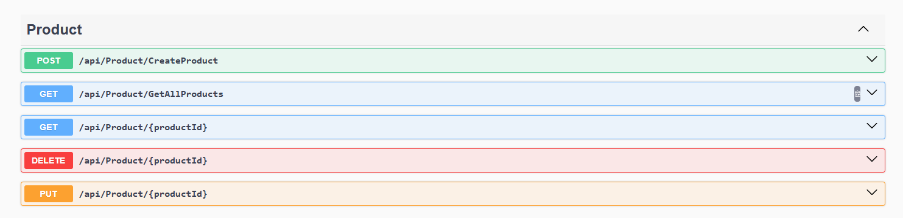
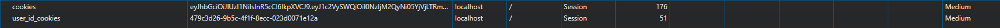
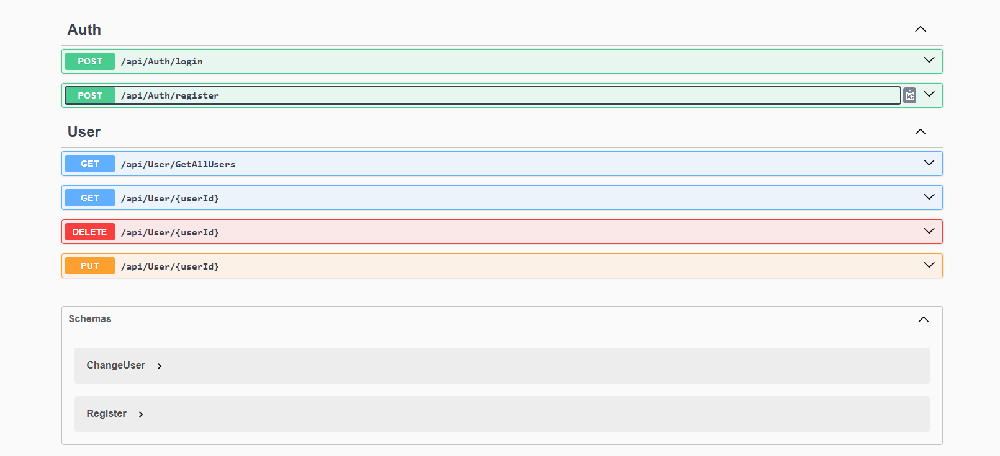
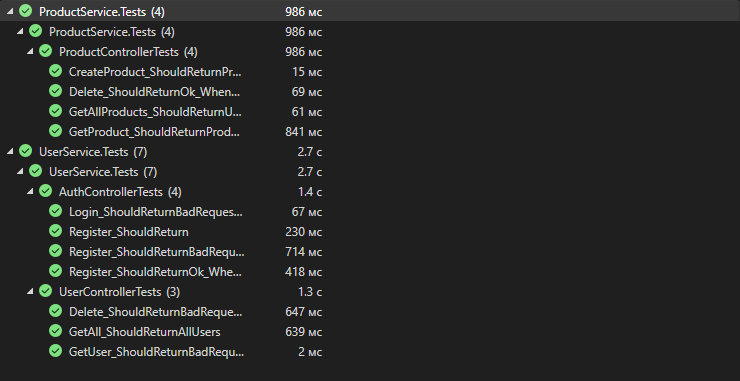

# **InnoShop REST API Application**


## Setting up and running application in Docker

This guide will help you set up and run the application using Docker Compose.


### Steps to Run the Application

1. **Clone the Repository**

   Clone the repository to your local machine:

   ```bash
   git clone https://github.com/Emandrr/InnoShop
   
2. **Execute docker-compose up**

    Open terminal on the root of project and execute command:
    
    ```bash
    docker-compose up --build
**All migrations are implemented, so there are no additional requirements for database**
   
3. **Ready**

    Now, you can access your application by navigating to the following URLs:
    
    - **User microservice**: [https://localhost:2000](https://localhost:2000)
    - **Product microservice**: [https://localhost:3000](https://localhost:3000)


## Functionality
### User management microservice

Implements CRUD operations with user:
   - Registration user
   - Login user
   - Deleting user
   - Getting all users
   - Getting user by id
   - Update user


Supports Cookie to store JWToken and another info after user's login


##

### Product management microservice

Implements CRUD operations with product:
   - Create product
   - Update product
   - Delete product
   - Get all products
   - Get product by id

Support authentication and authorisation by JWT access token
   - Create, update and delete products is allowed only for authorized users
   - Update and delete products can only owner



### Tests

Main functionality is covered by using Unit tests

